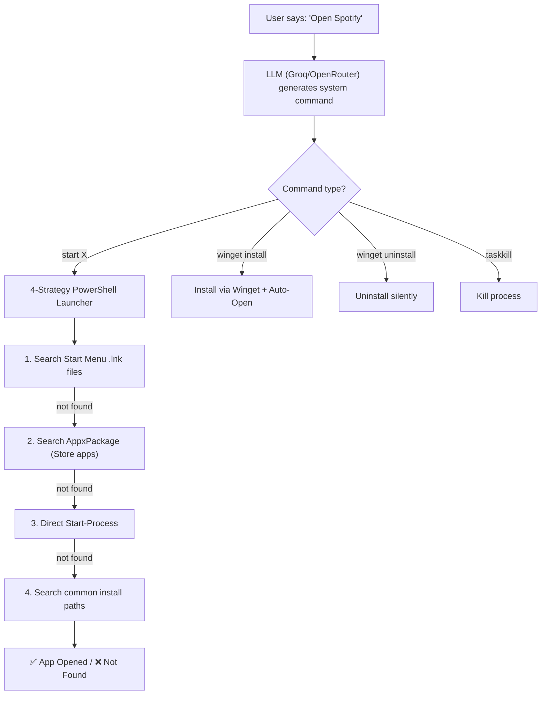
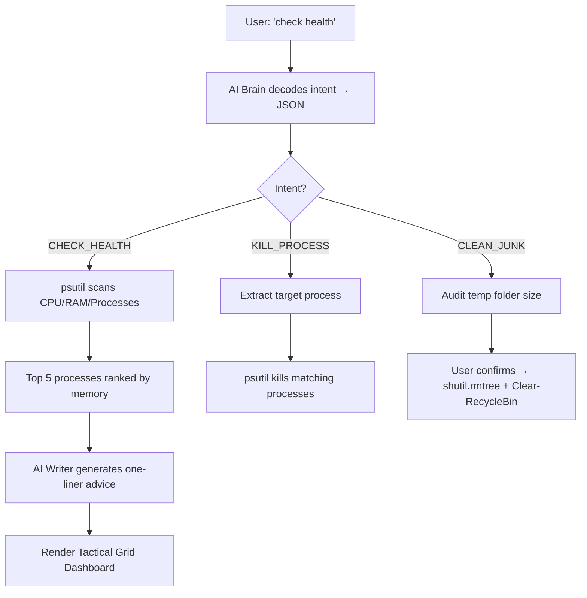
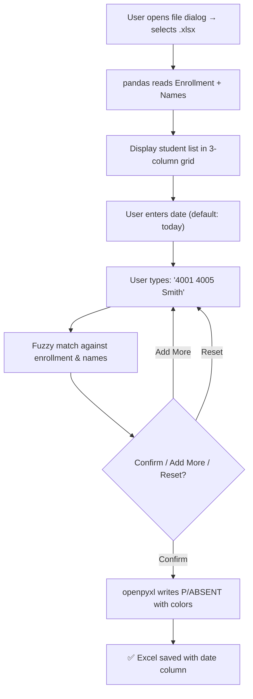
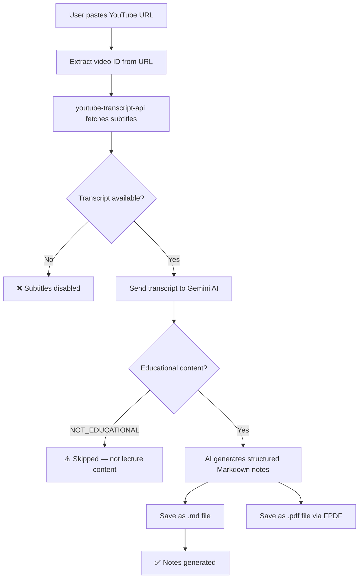
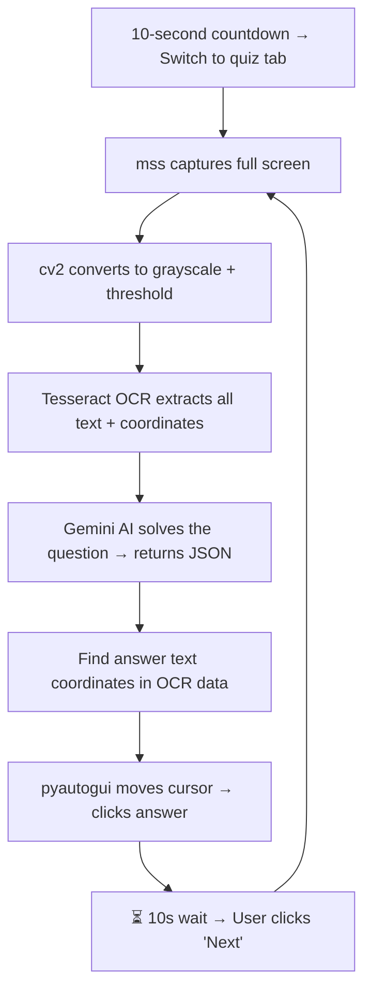
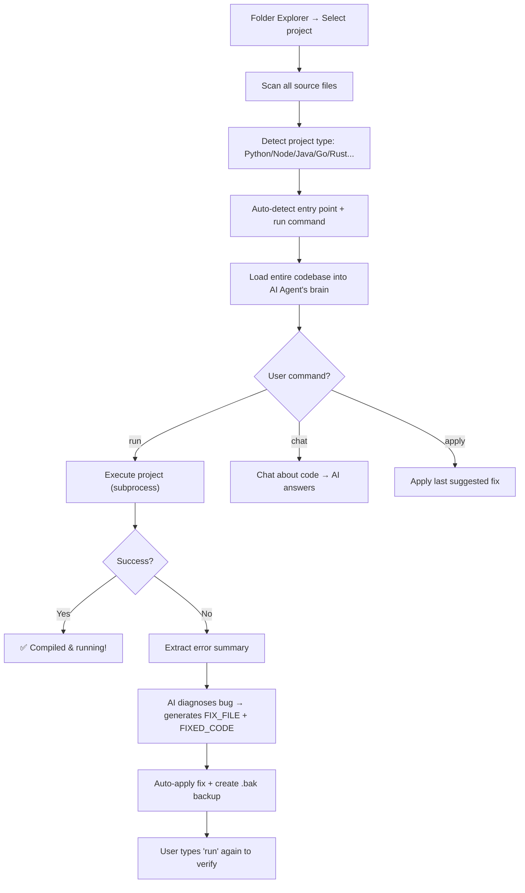
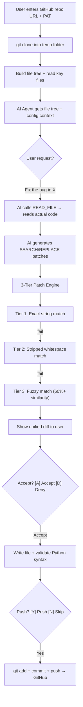
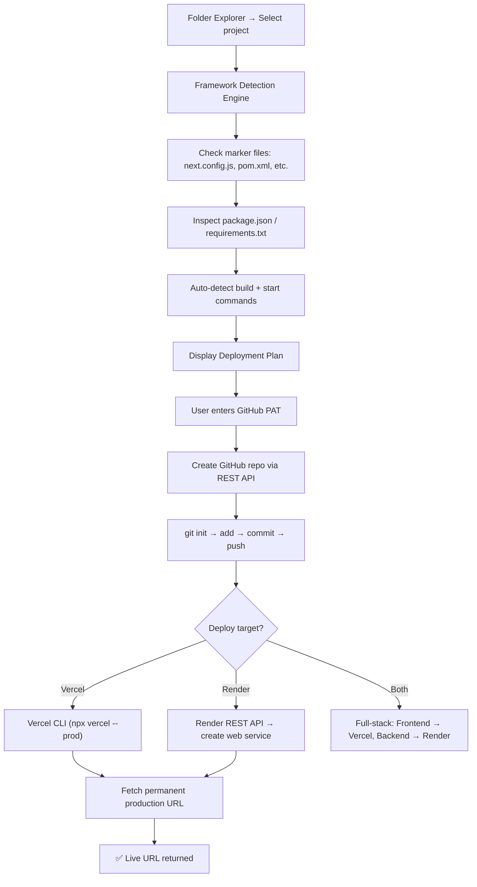
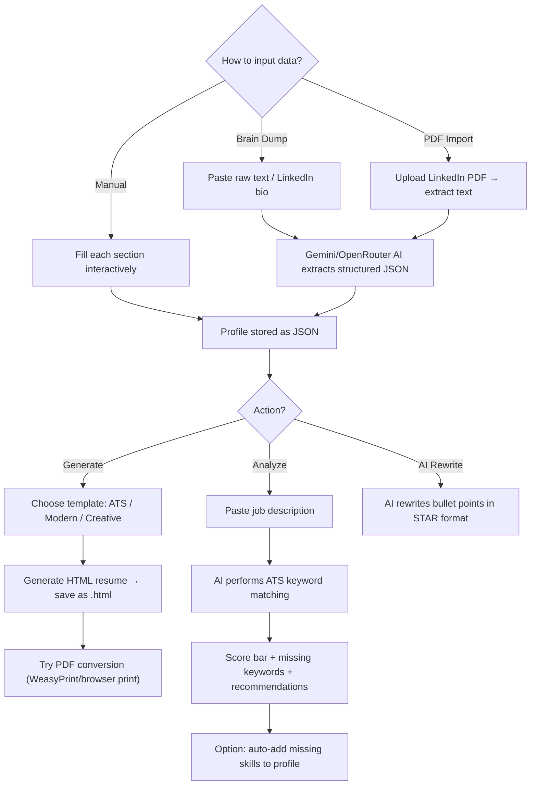
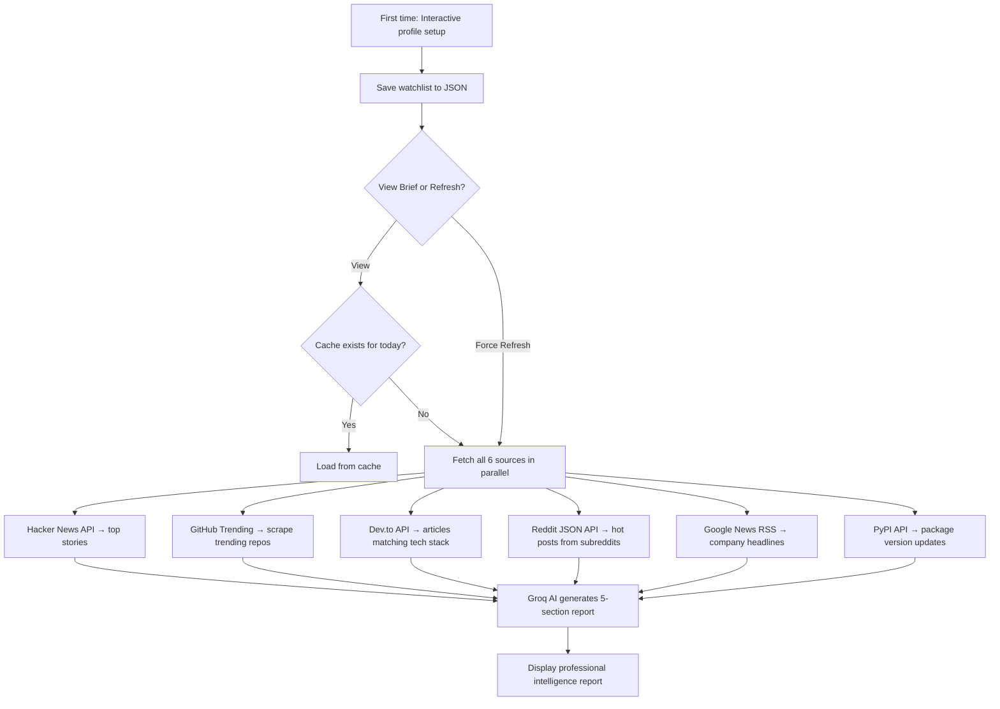

# 🧠 THE ALOA — Autonomous Laptop Operating Agent

> **A** utonomous **L** aptop **O** perating **A** gent

---

## What is ALOA?

**THE ALOA** is a fully autonomous, AI-powered desktop assistant that orchestrates **10 distinct automations** — each solving a real-world problem through intelligent agent loops, multi-model AI fallbacks, and direct OS-level control.

It is **not** a chatbot. It is an **agent** — a system that **perceives** its environment, **decides** what to do, and **acts** on your behalf.

> [!IMPORTANT]
> ALOA stands for **"Autonomous Laptop Operating Agent"** — an intelligent AI agent that lives on your laptop, understands your operating system, and autonomously performs complex tasks that would otherwise require manual human effort.

---

## 🏗️ Architecture At A Glance

```
┌──────────────────────────────────────────────────────┐
│                     main.py                          │
│              Interactive CLI Hub (v2.0)               │
│               "Select Automation [1-10]"             │
└────────┬──────────┬──────────┬──────────┬────────────┘
         │          │          │          │
    ┌────▼────┐ ┌───▼───┐ ┌───▼───┐ ┌───▼────┐
    │Feature 1│ │Feat.2 │ │Feat.3 │ │  ...   │   × 10
    │ core.py │ │core.py│ │core.py│ │        │
    │runner.py│ │run.py │ │run.py │ │        │
    └─────────┘ └───────┘ └───────┘ └────────┘
         │
   ┌─────▼─────────────────────────────────────┐
   │         AI Backend Layer                   │
   │  Groq · Gemini · OpenRouter · AWS Bedrock  │
   │     (Auto-fallback on rate-limit/block)     │
   └────────────────────────────────────────────┘
```

| Metric | Value |
|--------|-------|
| Total Python Files | 33 |
| Total Lines of Code | **8,000+** |
| Automations | **10** |
| AI Providers | 5 (Groq, Gemini, OpenRouter, Bedrock, Groq direct) |
| API Keys Used | 10 distinct keys with rotation |

---

## 📋 The 10 Automations — Overview

| # | Automation Name | One-Line Description |
|---|-----------------|---------------------|
| 1 | **App Manager** | Open, install, or uninstall any app using natural language |
| 2 | **System Doctor** | AI-powered health dashboard + junk cleaner + process killer |
| 3 | **Attendance Automator** | Auto-fill Excel attendance sheets in seconds |
| 4 | **YouTube Note Generator** | Convert any YouTube video into structured PDF notes |
| 5 | **Exam Pilot** | AI reads on-screen quiz questions and auto-clicks answers |
| 6 | **Code Healer** | Autonomous local code debugger — scan, run, fix, loop |
| 7 | **Cloud Healer** | AI agent for debugging live GitHub repos remotely |
| 8 | **Auto-Deployer** | One-command project deployment to Vercel / Render via GitHub |
| 9 | **Resume Engine** | Generate professional resumes with ATS scoring |
| 10 | **ALOA Radar** | Personalized daily intelligence brief from 6+ live sources |

---

# 🔧 Automation 1 — App Manager

> *"Open Instagram" → ALOA opens Instagram in under 2 seconds.*

### What It Does

The App Manager lets you **open**, **install**, **uninstall**, or **kill** any application on Windows using **plain English or Hinglish** commands. An LLM translates your intent into the exact system command, and a multi-strategy PowerShell launcher finds and opens any app.

### How It Works — Flow



### Example

```
User: "Download VLC"
LLM Output: winget install "VLC media player" -e --silent --accept-package-agreements
→ VLC installs silently
→ ALOA auto-opens VLC after install
```

```
User: "Instagram band kar do"  (Hinglish: close Instagram)
LLM Output: taskkill /IM Instagram.exe /F
→ Instagram process killed
```

### How to Run

```bash
python main.py
# Select [1] App Manager
# Type: "Open Chrome" or "Download VS Code"
```

---

# 🏥 Automation 2 — System Doctor

> *AI-diagnosed health checks with a tactical military-style dashboard.*

### What It Does

System Doctor performs **real-time system health scans**, displays CPU/RAM usage with impact analysis, identifies resource-hogging processes, cleans system junk, and can **kill specific processes** — all through AI-driven natural language commands.

### How It Works — Flow



### Dashboard Output Example

```
╔════════════════════════════════════════════════════════════╗
║  ⚡ ALOA SYSTEM OVERWATCH              [ STATUS: ONLINE 🟢 ]  ║
╚════════════════════════════════════════════════════════════╝
     🕒 TIME: 02:45 PM

  [ SYSTEM VITALS ]
  ▰▰▰▰▰▰▱▱▱▱▱▱▱▱▱ CPU : 35%  (Stable)
  ▰▰▰▰▰▰▰▰▰▱▱▱▱▱▱ RAM : 62%  (Stable)

  [ TOP RESOURCE CONSUMERS ]
   PID     | PROCESS NAME          | MEMORY   | IMPACT
   3412    | Chrome                | 1.8 GB   | 🔥 CRITICAL
   5820    | Code                  | 512 MB   | 🔸 MODERATE
   2891    | Spotify               | 245 MB   | 🔹 NORMAL

  💡 INTEL: System is stable. Chrome is your biggest memory hog.
```

### How to Run

```bash
python main.py
# Select [2] System Doctor
# Type: "check health" / "kill chrome" / "clean junk"
```

---

# 🎓 Automation 3 — Attendance Automator

> *30 seconds to mark attendance for an entire class.*

### What It Does

Loads an Excel attendance sheet, displays student list, lets you mark absentees by typing **last 4 digits of enrollment or names**, and auto-saves with date-stamped columns — `P` (green) for present, `ABSENT` (red) for absent.

### How It Works — Flow



### Example

```
File: Class_A_2026.xlsx
Date: 22/04/2026

Input: "4001 4005 Rahul"
→ Marked Absent: Priyanshu Sharma (4001), Ananya Singh (4005), Rahul Verma (4012)

[C] Confirm & Save
→ ✅ Attendance for '22/04/2026' saved successfully.
→ Excel now has a new column "22/04/2026" with P and ABSENT values
```

### How to Run

```bash
python main.py
# Select [3] Attendance Automator
# A file dialog opens — select your Excel file
# Enter date, type absentee roll numbers, confirm
```

---

# 📝 Automation 4 — YouTube Note Generator

> *Paste a YouTube link → Get structured lecture notes as PDF.*

### What It Does

Extracts the transcript from any YouTube video, feeds it to **Gemini AI** as an "Expert Professor" agent, and generates structured notes in **Markdown + PDF** format — including title, core concept, detailed breakdown, workflow steps, applications, and summary.

### How It Works — Flow



### Example

```
Input: https://www.youtube.com/watch?v=dQw4w9WgXcQ

🆔 Video ID: dQw4w9WgXcQ
📥 Fetching Transcript... Success.
📄 Transcript Length: 12,847 characters
⏳ AI Professor is analyzing... Done. ✅
📝 Filename: Python_OOP_Basics

✅ NOTES GENERATED SUCCESSFULLY
📂 Markdown File: Python_OOP_Basics.md
📄 PDF Document : Python_OOP_Basics.pdf
```

### How to Run

```bash
python main.py
# Select [4] YouTube Note Generator
# Paste any YouTube educational video link
# Enter a filename → .md and .pdf are generated
```

---

# 🤖 Automation 5 — Exam Pilot

> *AI reads the screen, solves the question, clicks the answer.*

### What It Does

A semi-autonomous quiz-solving agent. It **captures your screen**, uses **Tesseract OCR** to extract the question text, sends it to **Gemini AI** to find the correct answer, **locates the answer on screen**, and **clicks it with pyautogui**. You only click "Next".

### How It Works — Flow



### Example

```
Screen shows: "What is the capital of France?"
Options: A) London  B) Berlin  C) Paris  D) Madrid

🧠 Solving... Done.
💡 Answer: Paris
🎯 Clicking at (450, 382)
✅ Answer Clicked.
👉 Please click 'NEXT' manually.
```

### Key Feature Details

- **3-key Gemini rotation** — avoids rate limits during exam
- **Model fallback**: `gemini-2.5-flash` → `gemini-1.5-flash`
- **OCR coordinate mapping** — uses Tesseract's bounding box data to locate answer text on screen

### How to Run

```bash
python main.py
# Select [5] Exam Pilot
# Press Enter → 10 second timer to switch to quiz
# AI scans → solves → clicks in a continuous loop
# Move mouse to corner to stop (failsafe)
```

---

# 🛠️ Automation 6 — Code Healer

> *Point it at any project folder. It reads, runs, diagnoses, and fixes bugs autonomously.*

### What It Does

A **full-blown AI coding agent**. Select a local project folder → ALOA scans every source file, auto-detects the language/framework, finds the entry point, runs the project, and if errors occur — it **automatically sends them to AI, gets a fix, applies it, and re-runs**. It also maintains a conversational chat for asking questions about your code.

### How It Works — Flow



### Supported Languages

| Language | Detection | Run Command |
|----------|-----------|-------------|
| Python | `requirements.txt`, `__main__` patterns | `python main.py` |
| Node.js | `package.json` with `scripts.start` | `npm start` |
| Java | `pom.xml`, `build.gradle` | `mvn compile` / `gradle run` |
| C/C++ | `Makefile`, `CMakeLists.txt` | `make && ./a.out` |
| Go | `go.mod` | `go run .` |
| Rust | `Cargo.toml` | `cargo run` |
| Ruby, PHP, Dart | Respective markers | Auto-detected |

### Smart Features

- **Dev Server Detection**: Recognizes `npm start`, `flask run`, `next dev` etc. — captures output for 30s then terminates
- **Port Conflict Resolution**: Auto-kills processes on occupied ports
- **False Positive Filtering**: Ignores noise like `DeprecationWarning`, `npm warn`, `error-overlay`
- **Backup System**: Creates `.bak` files before every fix

### Example

```
📂 Project: my-react-app
📄 23 files (15.js, 4.css, 3.json, 1.html)
🏷️  NODE
▶️  npm start

🚀 Executing: npm start...
❌ Error: Module not found: Cannot find module './Components/Header'

🧠 AI is analyzing the error...
🤖 The import path uses incorrect casing. The actual folder is 'components' not 'Components'.

💾 Fixing: src/App.js...
✅ Fixed! Backup saved as .bak
🔄 Type 'run' to verify.
```

### How to Run

```bash
python main.py
# Select [6] Code Healer
# Folder picker opens → select any project folder
# Type "run" to execute, or chat about your code
```

---

# ☁️ Automation 7 — Cloud Healer

> *Debug and fix code directly on GitHub — no local clone needed.*

### What It Does

Give it a **GitHub repo URL + PAT token**, and ALOA clones it into a temp workspace, gives an AI agent full access to the codebase, lets you chat about bugs or request fixes, **validates Python syntax before applying changes**, uses a **3-tier diff patching engine** (exact → stripped → fuzzy), and can **push fixes directly back to GitHub**.

### How It Works — Flow



### Double-Lock Permission System

1. **Accept/Deny** — User reviews the diff before applying
2. **Push/Skip** — User confirms before pushing to GitHub

### Example

```
Repo: https://github.com/user/flask-api
🔄 Cloning... Done.
📄 12 files (8.py, 2.yml, 1.txt, 1.md)

You: "The /api/users endpoint returns 500"

🤖 I need to read the route file first.
READ_FILE: routes/users.py
[SYSTEM reads file and returns content]

🤖 The issue is on line 23. You're calling `db.query()` without
   a session context. Here's the fix:

FILE: routes/users.py
SEARCH: result = db.query(User).all()
REPLACE: with db.session() as s: result = s.query(User).all()

[A] Accept  [D] Deny → A
✅ Patched routes/users.py
[Y] Push  [N] Skip → Y
✅ Successfully pushed fixes to GitHub.
```

### How to Run

```bash
python main.py
# Select [7] Cloud Healer
# Enter GitHub repo URL + Personal Access Token
# Chat with the agent → review diffs → push fixes
```

---

# 🚀 Automation 8 — Auto-Deployer

> *Select a folder → ALOA detects the framework → pushes to GitHub → deploys to Vercel/Render → returns live URL.*

### What It Does

A **fully autonomous deployment pipeline**. It detects your project framework (Next.js, React, Flask, Django, Spring Boot, static HTML... 17+ frameworks), creates a GitHub repo, pushes code, deploys to the right platform (Vercel for frontend, Render for backend), and returns your **live production URL**.

### How It Works — Flow



### Supported Frameworks (17+)

| Frontend (→ Vercel) | Backend (→ Render) |
|--------------------|-------------------|
| Next.js, React, Vue | Flask, Django, FastAPI |
| Gatsby, Nuxt, Svelte | Express, Fastify, NestJS |
| Astro, Angular | Spring Boot (Java) |
| Static HTML/CSS/JS | Go, Rust, Ruby |

### Smart Features

- **Full-stack monorepo detection** — detects `client/` + `server/` folders
- **Auto-generates `.gitignore`** if missing
- **Env var injection** — reads `.env` files and passes to deployment
- **Permanent URL resolution** — fetches the real `.vercel.app` URL, not temp deploy links

### Example

```
📂 Project: my-portfolio
🏷️  Framework: Next.js
🎯 Deploy Target: Vercel
📦 Build: npm install && npm run build
▶️  Start: npm start

🔗 GitHub: https://github.com/user/my-portfolio ✅
🚀 Deploying to Vercel...
✅ Live URL: https://my-portfolio-olive-three.vercel.app
```

### How to Run

```bash
python main.py
# Select [8] Auto-Deployer
# Select project folder → Enter GitHub PAT → Enter Vercel/Render token
# ALOA handles everything autonomously
```

---

# 📄 Automation 9 — Resume Engine

> *Build, analyze, and generate professional resumes with 3 beautiful templates.*

### What It Does

A complete **AI-powered resume pipeline**: input your data via **Brain Dump** (paste raw text, LinkedIn PDF, or manual entry) → AI extracts structured profile → choose from **3 premium templates** (ATS Classic, Modern Professional, Creative Two-Column) → generate HTML/PDF → run **ATS analysis against any job description** with a match score.

### How It Works — Flow



### Template Gallery

| Template | Style | Best For |
|----------|-------|----------|
| 📄 ATS Classic | Single-column, clean | FAANG, Engineering |
| 🎯 Modern Professional | Colored header, timeline | Corporate, Consulting |
| 🎨 Creative Two-Column | Dark sidebar, skill bars | Design, Marketing |

### ATS Analysis Example

```
ATS Match Score: ████████████████░░░░ 78%

✅ Matching Keywords (14): Python, React, AWS, Docker, REST API...
❌ Missing Keywords (6): Kubernetes, GraphQL, Terraform...

💪 Strengths:
   1. Strong project portfolio with quantified impact
   2. Relevant tech stack alignment

💡 Recommendations:
   1. Add Kubernetes to skills — mentioned 3x in JD
   2. Rewrite bullet #2 with metrics
```

### How to Run

```bash
python main.py
# Select [9] Resume Engine
# Choose: New Profile / Load Existing / Brain Dump / PDF Import
# Edit sections → Generate resume → Analyze against JD
```

---

# 📡 Automation 10 — ALOA Radar

> *Your personalized daily intelligence brief — from 6+ live sources.*

### What It Does

A **personalized news aggregation + AI intelligence system**. You set up your profile (tech stack, target companies, interests, subreddits, packages to track, and optionally your resume) — ALOA fetches live data from **Hacker News, GitHub Trending, Dev.to, Reddit, Google News, PyPI** — and generates a **professional 5-section AI intelligence report** tailored to you.

### How It Works — Flow



### The 5 Report Sections

| Section | Content |
|---------|---------|
| 📌 **Current Affairs** | Global tech/business news highlights |
| 🔬 **Tech News** | News relevant to your specific tech stack |
| 🚀 **Trending Tech** | What's rising fastest (from GitHub + Dev.to) |
| 💡 **General Knowledge** | Interesting insights that broaden perspective |
| 🎯 **Suggestions For You** | 3 actionable career suggestions based on your resume + today's data |

### Optional Resume Integration

If you upload your resume (PDF or paste), the AI uses it to generate hyper-personalized suggestions — e.g., "Based on your Python experience, consider contributing to the trending `langchain` repo" or "TCS announced new AI hiring — your ML skills are a strong match."

### Example Output

```
  ━━━━━━━━━━━━━━━━━━━━━━━━━━━━━━━━━━━━━━━━━━━━
  🧠  ALOA INTELLIGENCE REPORT  —  Priyanshu
       April 22, 2026
  ━━━━━━━━━━━━━━━━━━━━━━━━━━━━━━━━━━━━━━━━━━━━

  📌  CURRENT AFFAIRS
     OpenAI announced GPT-5 pricing adjustments...

  🔬  TECH NEWS
     The Python 3.14 release candidate adds...

  🚀  TRENDING TECH
     LangGraph and CrewAI are dominating GitHub trending...

  💡  GENERAL KNOWLEDGE
     Stack Overflow's 2026 survey shows 48% of developers...

  🎯  SUGGESTIONS FOR YOU
     1. Your Flask + React stack aligns with the new Vercel
        AI SDK — explore building an AI-powered feature.
     2. TCS Ninja hiring is open — your profile matches...
     3. Contribute to the trending `fastapi` repo...
```

### How to Run

```bash
python main.py
# Select [10] ALOA Radar
# First time: Set up profile (name, tech stack, companies, subreddits)
# Select [1] to view brief, [2] to force refresh
# Optionally upload resume via [4] for personalized suggestions
```

---

## 🔧 How to Run the Entire Project

### Prerequisites

```bash
# Python 3.10+
python --version

# Install dependencies
pip install -r requirements.txt

# Additional for Exam Pilot:
# Install Tesseract OCR: https://github.com/tesseract-ocr/tesseract
```

### API Keys Setup

Create a `.env` file in the project root (copy from `.env.example`):

```env
# Main LLM (Features 1, 2)
GROQ_API_KEY=your_groq_key

# Gemini (Features 4, 6, 9)
GEMINI_API_KEY_1=your_gemini_key_1
GEMINI_API_KEY_2=your_gemini_key_2

# Exam Pilot — 3-key rotation (Feature 5)
GEMINI_API_KEY_F5_1=your_key
GEMINI_API_KEY_F5_2=your_key
GEMINI_API_KEY_F5_3=your_key

# Unlimited Fallback (Features 6, 7, 8, 9)
OPENROUTER_API_KEY=your_openrouter_key

# Cloud Healer (Feature 7)
BEDROCK_API_KEY=your_bedrock_key
```

### Launch

```bash
python main.py
```

```
============================================================
      THE ALOA - Agentic AI Assistant (v2.0)
============================================================
 System: Online | Phase 2: Intelligence Layer Active

  Available Features:
  [1] App Manager          [6] Code Healer
  [2] System Doctor        [7] Cloud Healer
  [3] Attendance Auto      [8] Auto-Deployer
  [4] YouTube Notes        [9] Resume Engine
  [5] Exam Pilot           [10] ALOA Radar
  [X] Exit
```

---

## 🧩 Tech Stack Summary

| Category | Technologies |
|----------|-------------|
| **Language** | Python 3.10+ |
| **AI LLMs** | Groq (Llama 3.1), Google Gemini 2.0 Flash, OpenRouter (auto model), AWS Bedrock (Claude 3.5) |
| **AI Framework** | LangChain, LangChain-Groq, Google GenAI |
| **Computer Vision** | OpenCV (cv2), Tesseract OCR, mss (screen capture) |
| **GUI Automation** | pyautogui, keyboard, pyperclip |
| **Data Processing** | pandas, openpyxl, FPDF2, PyPDF2, BeautifulSoup4 |
| **System Control** | psutil, subprocess, PowerShell integration |
| **Web Scraping** | requests, urllib, xml.etree (RSS parsing) |
| **Deployment** | Git CLI, GitHub REST API, Vercel CLI, Render REST API |
| **Config** | python-dotenv (.env management) |

---

> [!TIP]
> **THE ALOA** is not 10 separate scripts glued together — it's **one unified agent system** where automations share utilities, AI fallback chains, and a consistent UX. Features 6, 7, and 8 share the same scanning engine. Features 1 and 2 share the same dual-model fallback. The entire system is designed for **zero single-point-of-failure** — if one API is blocked, another takes over automatically.
